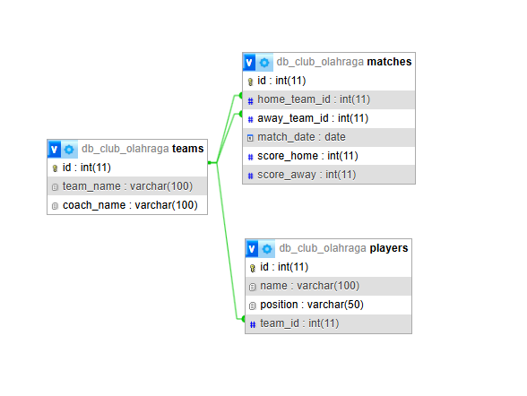

# Janji
Saya Daffa Faiz Restu Oktavian dengan NIM 2309013 mengerjakan Tugas Praktikum 7 dalam mata kuliah Desain dan Pemrograman Berorientasi Objek untuk keberkahanNya maka saya tidak melakukan kecurangan seperti yang telah dispesifikasikan. Aamiin.
# Desain Program

### 1. Database
Database terdiri dari tiga tabel utama:
- **`teams`**: Menyimpan data tim (id, nama tim, nama pelatih).
- **`players`**: Menyimpan data pemain (id, nama, posisi, id tim).
- **`matches`**: Menyimpan data pertandingan (id, tim tuan rumah, tim tamu, tanggal pertandingan, skor).

### 2. Kelas PHP
- **`Team`** ([class/Teams.php](class/Teams.php)): Mengelola data tim, termasuk operasi CRUD dan pencarian.
- **`Player`** ([class/Players.php](class/Players.php)): Mengelola data pemain, termasuk operasi CRUD, pencarian, dan pengelompokan berdasarkan tim.
- **`MatchGame`** ([class/Matches.php](class/Matches.php)): Mengelola data pertandingan, termasuk operasi CRUD dan pencarian.

### 3. **Tampilan**
- **`header.php`**: Header navigasi untuk semua halaman.
- **`teams.php`**: Menampilkan daftar tim dan formulir untuk menambah tim.
- **`players.php`**: Menampilkan daftar pemain berdasarkan tim dan formulir untuk menambah pemain.
- **`matches.php`**: Menampilkan jadwal pertandingan dan formulir untuk menambah pertandingan.
- **`edit_team.php`**, **`edit_player.php`**, **`edit_match.php`**: Formulir untuk mengedit data tim, pemain, dan pertandingan.

# Alur Program

### 1. **Halaman Utama**
- Pengguna diarahkan ke halaman utama yang berisi navigasi ke halaman tim, pemain, dan pertandingan.

### 2. **Manajemen Tim**
- **Tampilan**: [view/teams.php](view/teams.php)
- Pengguna dapat:
  - Melihat daftar tim.
  - Menambah tim baru melalui formulir.
  - Mengedit data tim melalui tombol "Edit".
  - Menghapus tim melalui tombol "Hapus".

### 3. **Manajemen Pemain**
- **Tampilan**: [view/players.php](view/players.php)
- Pengguna dapat:
  - Melihat daftar pemain berdasarkan tim.
  - Menambah pemain baru melalui formulir.
  - Mengedit data pemain melalui tombol "Edit".
  - Menghapus pemain melalui tombol "Hapus".
  - Mencari pemain berdasarkan nama.

### 4. **Manajemen Pertandingan**
- **Tampilan**: [view/matches.php](view/matches.php)
- Pengguna dapat:
  - Melihat jadwal pertandingan.
  - Menambah pertandingan baru melalui formulir.
  - Mengedit data pertandingan melalui tombol "Edit".
  - Menghapus pertandingan melalui tombol "Hapus".
  - Mencari pertandingan berdasarkan nama tim atau tanggal.

### 5. **Operasi CRUD**
- Operasi CRUD dilakukan melalui form yang dikirimkan ke [index.php](index php).
- **CREATE**: Data baru ditambahkan ke database.
- **READ**: Data diambil dari database untuk ditampilkan.
- **UPDATE**: Data yang ada diperbarui melalui form edit.
- **DELETE**: Data dihapus berdasarkan ID.

# Dokumentasi
